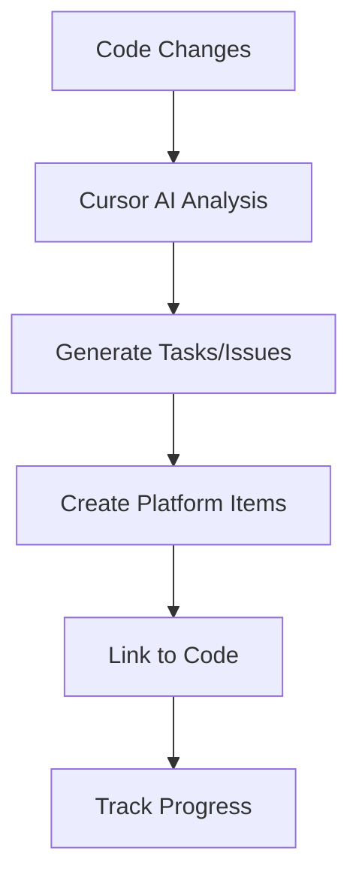
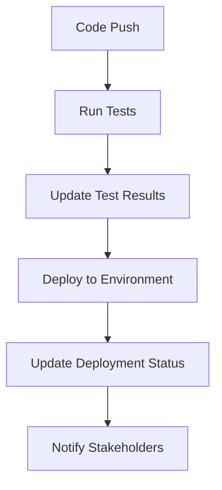

# Getting Started with Cursor Enterprise Connectors

This guide will help you set up and use Cursor Enterprise Connectors to integrate your development workflow with enterprise platforms.

## 📋 Prerequisites

Before you begin, ensure you have:

- **Cursor IDE** installed ([Download here](https://cursor.sh/))
- **Node.js 18+** or **Python 3.8+** installed
- Access to at least one supported enterprise platform
- API credentials for your chosen platform(s)

## 🚀 Quick Setup

### 1. Clone the Repository

```bash
git clone https://github.com/your-username/cursor-enterprise-connectors.git
cd cursor-enterprise-connectors
```

### 2. Install Dependencies

Choose your preferred runtime:

#### Node.js
```bash
npm install
```

#### Python
```bash
pip install -r requirements.txt
```

### 3. Run the Setup Wizard

```bash
# Interactive setup for all platforms
npm run setup
# or
python tools/setup-wizard/setup.py
```

The setup wizard will guide you through:
- Platform selection
- Credential configuration
- Connection testing
- Basic configuration

### 4. Configure Your First Platform

Choose a platform to start with:

#### Salesforce
```bash
cp connectors/salesforce/config/config.example.json connectors/salesforce/config/config.json
```

Edit the configuration file with your Salesforce credentials:
```json
{
  "salesforce": {
    "loginUrl": "https://login.salesforce.com",
    "clientId": "YOUR_CONSUMER_KEY",
    "clientSecret": "YOUR_CONSUMER_SECRET",
    "username": "your-email@company.com",
    "password": "your-password-and-security-token"
  }
}
```

#### Jira/Atlassian
```bash
cp connectors/atlassian/config/config.example.json connectors/atlassian/config/config.json
```

Configure with your Atlassian credentials:
```json
{
  "atlassian": {
    "jira": {
      "baseUrl": "https://your-company.atlassian.net",
      "email": "your-email@company.com",
      "apiToken": "YOUR_API_TOKEN"
    }
  }
}
```

### 5. Test Your Connection

```bash
# Test specific platform
npm run test:connection -- --platform salesforce
npm run test:connection -- --platform atlassian

# Test all configured platforms
npm run test:connection
```

## 🎯 Your First Integration

Let's create a simple workflow that demonstrates the power of these integrations.

### Example: Create Jira Ticket from Code Comment

1. **Add a TODO comment** in your code:
```javascript
// TODO: Optimize this database query for better performance
// @jira-ticket: high priority performance issue
function expensiveQuery() {
  // ... your code here
}
```

2. **Use Cursor AI** to generate a Jira ticket:
```
🤖 Cursor Prompt: "Create a Jira ticket for the TODO comment above with high priority"
```

3. **The integration will**:
   - Parse the comment and context
   - Create a detailed Jira ticket
   - Link it back to your code location
   - Set appropriate labels and priority

### Example: Generate Salesforce SOQL Query

1. **Ask Cursor AI** for help:
```
🤖 Cursor Prompt: "Generate a SOQL query to find all Accounts created in the last 30 days with related Contacts"
```

2. **Get intelligent assistance**:
```sql
SELECT Id, Name, CreatedDate, 
       (SELECT Id, FirstName, LastName, Email FROM Contacts)
FROM Account 
WHERE CreatedDate = LAST_N_DAYS:30
ORDER BY CreatedDate DESC
```

## 🔧 Available Commands

### Testing and Validation
```bash
# Test all connections
npm run test:connection

# Test specific connector
npm run test:connector -- salesforce

# Run full test suite
npm test
```

### Development
```bash
# Start development server
npm run dev

# Generate new connector
npm run generate:connector -- --platform your-platform

# Lint and fix code
npm run lint:fix
```

### Utilities
```bash
# Generate documentation
npm run docs

# Build production version
npm run build

# Setup wizard
npm run setup
```

## 📚 Next Steps

### Explore Platform-Specific Guides

- [Salesforce Integration Guide](../connectors/salesforce/README.md)
- [Atlassian Integration Guide](../connectors/atlassian/README.md)
- [GitLab Integration Guide](../connectors/gitlab/README.md)
- [Boomi Integration Guide](../connectors/boomi/README.md)
- [TestRail Integration Guide](../connectors/testrail/README.md)

### Advanced Configuration

1. **Environment Variables**: Set up different configurations for development, staging, and production
2. **Custom Templates**: Create your own code templates and workflows  
3. **Webhooks**: Set up real-time integrations with webhooks
4. **Automation**: Build automated workflows using the connector APIs

### Common Workflows

#### Development Workflow


#### CI/CD Integration


## ⚙️ Configuration Best Practices

### Security
- Never commit credentials to version control
- Use environment variables for sensitive data
- Rotate API tokens regularly
- Use least-privilege access principles

### Performance
- Configure appropriate timeouts and retries
- Use caching where applicable
- Implement rate limiting
- Monitor API usage

### Reliability
- Test connections before critical operations
- Implement proper error handling
- Use logging for debugging
- Set up monitoring and alerting

## 🐛 Troubleshooting

### Common Issues

#### Authentication Problems
- Verify API credentials are correct
- Check if tokens have expired
- Ensure proper permissions are granted
- Test with minimal required scopes first

#### Connection Issues  
- Verify network connectivity
- Check firewall and proxy settings
- Validate API endpoints and URLs
- Test with curl or Postman first

#### Performance Issues
- Check API rate limits
- Monitor response times
- Optimize query patterns
- Use bulk operations when available

### Getting Help

1. **Check the logs** - Enable debug logging to see detailed information
2. **Review documentation** - Platform-specific guides have detailed troubleshooting
3. **Search issues** - Check if others have faced similar problems
4. **Ask the community** - Use GitHub Discussions for questions

## 📈 Monitoring and Analytics

### Built-in Monitoring
- Connection health checks
- API usage tracking
- Performance metrics
- Error rate monitoring

### Custom Dashboards
Create custom monitoring dashboards to track:
- Integration success rates
- Response times
- Error patterns
- Usage trends

## 🎓 Learning Resources

### Cursor IDE
- [Cursor Documentation](https://cursor.sh/docs)
- [AI-Assisted Development](https://cursor.sh/blog)

### Platform APIs
- [Salesforce API](https://developer.salesforce.com/)
- [Atlassian API](https://developer.atlassian.com/)
- [GitLab API](https://docs.gitlab.com/ee/api/)
- [Boomi API](https://help.boomi.com/bundle/developer_apis/)
- [TestRail API](https://www.gurock.com/testrail/docs/api)

### Integration Patterns
- [Enterprise Integration Patterns](https://www.enterpriseintegrationpatterns.com/)
- [API Design Best Practices](https://swagger.io/resources/articles/best-practices-in-api-design/)
- [Webhook Security](https://webhooks.fyi/security)

---

**Ready to start building?** Choose your first platform and follow the specific integration guide!
